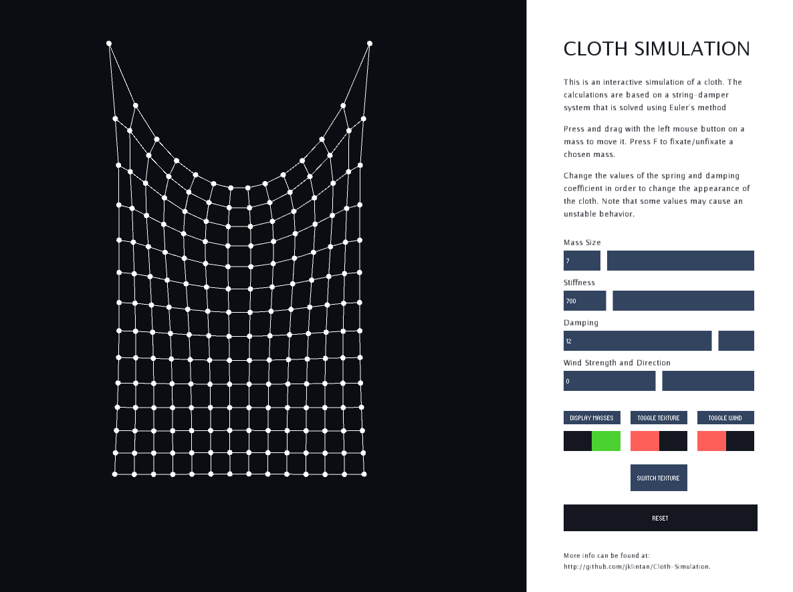
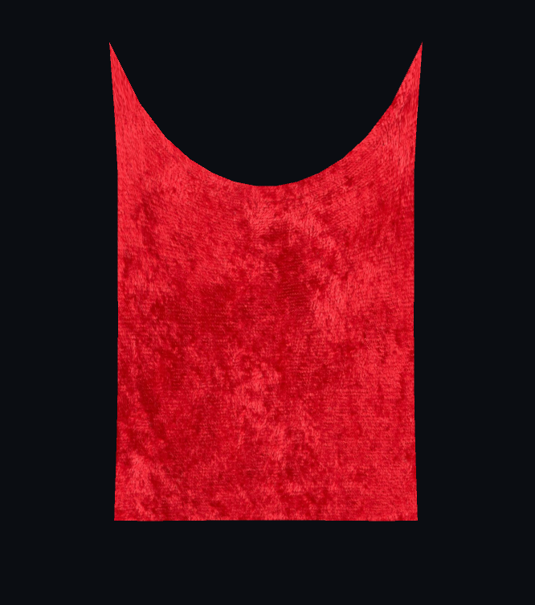

# Cloth Simulation
This is a simulation implementing a cloth simulation. The project was first implemented using Matlab and then using Processing. 

## Requirements

The following additional toolboxes are required to run the program in Matlab:

| Name                                    | 
| --------------------------------------- | 
| Navigation Toolbox                      | 
| Database Toolbox                        |


## Matlab

The core of the cloth model is a system of spring dampers. The model is built upon a structured lattice that consist of particles with a finite mass that are connected to each other by spring-dampers. The spring-damper generates a force on each particle based on its position and velocity. 

### Numerical methods

The simulation of the movement of the particles is based upon numerical methods. First the Euler method is used for both the position and the velocity according to: 

```
x(t+1) = x(t) + hx'(t)
x'(t+1) = x'(t) + hx''(t)
```

The acceleration is based on Newton's second law of motion with the force calculated as the sum of all forces acting on each particle.

Since the Euler method for the cloth simulation requires a very small timestep to stay stable, the Verlet method is implemented as an alternate simulation method according to: 
```
x(t+1) = 2x(t) - x(t-1) + h*h*x''(t)
x'(t+1) = 1/(2h)(x(t) - x(t-1)
```
This approach is an advantage since the position doesn't require the velocity to be calculated and it is also a more stable solution for the cloth simulation. This is the approach used for implementing the simulation in OpenGL. 

### Force update

Each mass in the cloth is affected by 3 to 8 spring forces and 3 to 8 damping forces, depending on its placement in the grid. The simulation loops through the 2D-array of masses and for each mass, it calculates the forces acting on it by the other particles. The forces are summed up along with the gravitational force, air resistance and wind force. Each mass then gets an updated position and velocity with the use of either the Euler method or the Verlet method. 

## Processing Implementation

The next approach for the simulation was to take it out of Matlab and implement in a graphical way. The group chose to work with Processing in order to obtain a simple way to create a rendering window. The code from the 2D-implementation in matlab was successfully implemented in Processing with a class called particle to represent the nodes in Matlab. 

A GUI and user interaction for allowing the user to change parameters of the cloth and to drag masses over the screen as well as fixating certain masses was added. The result from the final demo can be seen below: 



# Interaction
A lot of sliders and buttons are added in order to allow the user to interact with the parameters that builds up the cloth. Using the mousePressed and mouseDragged function, the user can interact with single masses in the cloth and drag them around. This is applied as an external force to the current mass and the user can either just drag it around or use the key F to fixate or unfixate chosen masses. 


# Texture

Using UV-coordinates for each of the masses in the lattice, it is possible to display an image as a texture over the cloth. With this, different types of fabric can be simulated. 



# Wind

Wind is implemented with the use of adding two different noises that are mapped together. The user can change the wind strength with a slider. 


## Sources and attribution

The 2D plot of the spring-damper system is built upon the approach of Auralius Manurung's [Matlab Project of a Deformable Object](https://www.mathworks.com/matlabcentral/fileexchange/52931-deformable-object-with-interconnected-mass-spring-damper) that uses the nodes system from the navigation toolbox in Matlab to represent the masses in the lattice. 

